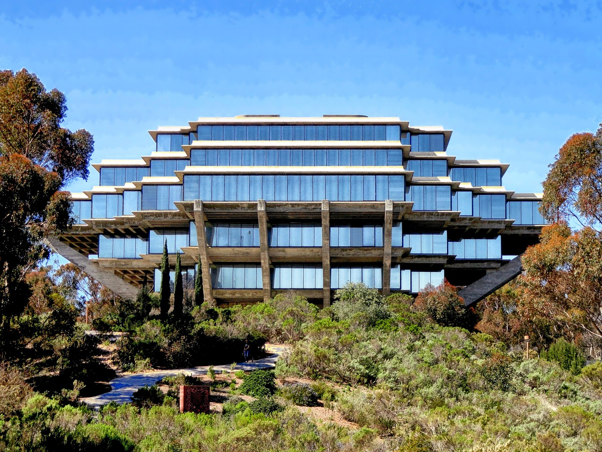

# Harrison's User Page
> "Any fool can write code that a computer can understand. Good programmers write code that humans can understand." — Martin Fowler

 Me at Yellowstone National Park

### **Welcome to my Github page!**

I'm a 3rd year computer engineering student at UCSD.
Go here if you want to contact me: [Contact](#contact)

## Fun facts
1. My favorite website to browse when I'm bored [YouTube](youtube.com)
2. I enjoy playing the piano!
3. My favorite color is `#0000ff`

Access the ReadME file for this project: [ReadME](/README.md)

## Contact
- hkung@ucsd.edu
- Send me a message in slack!

## Todo
- [x] ~~Finish User Page~~
- [ ] *Finish Group Project*

 My favorite place to hang out: 

